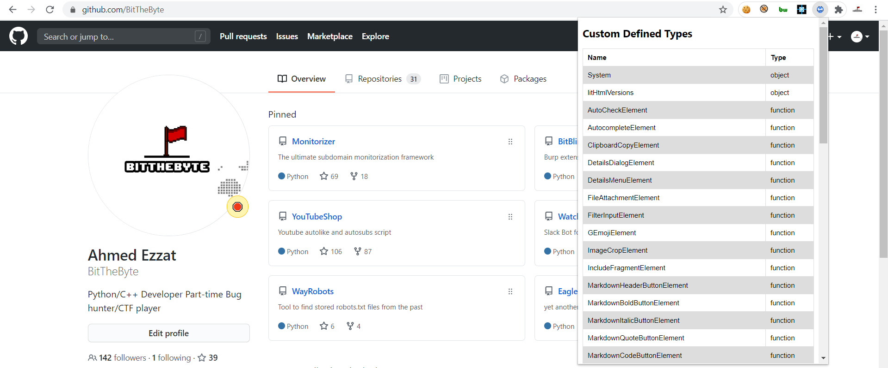

# BitDefinded

Chrome based extension to list custom defined javascript types

  

# Current Version
0.0.1b

# Why?
I mainly developed this tool to help me during bug bounty testing. based on my experience a lot of developers leave interesting functions at javascript files and finding those may be time-consuming - at least for me - 

# How to install
1) Go to [chrome://extensions/](chrome://extensions/)
2) Click on Load Unpacked
3) Select the folder containing this repo
4) You're ready to go

# Issues 
If you found an issue or have a feature request please open a new issue @ [https://github.com/BitTheByte/BitDefined/issues](https://github.com/BitTheByte/BitDefined/issues)